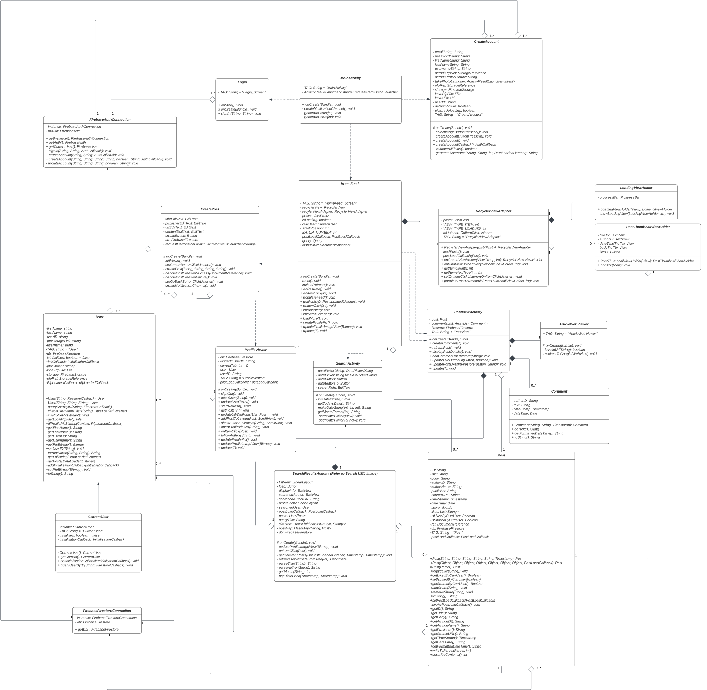

# [G63 - RAJ NP] Report

## Table of Contents

1. [Team Members and Roles](#team-members-and-roles)
2. [Summary of Individual Contributions](#summary-of-individual-contributions)
3. [Application Description](#application-description)
4. [Application UML](#application-uml)
5. [Application Design and Decisions](#application-design-and-decisions)
6. [Summary of Known Errors and Bugs](#summary-of-known-errors-and-bugs)
7. [Testing Summary](#testing-summary)
8. [Implemented Features](#implemented-features)
9. [Team Meetings](#team-meetings)
10. [Conflict Resolution Protocol](#conflict-resolution-protocol)

## Administrative
- Firebase Repository Link: <https://console.firebase.google.com/project/app-f4755/overview>
   - Confirm: I have already added comp21006442@gmail.com as a Developer to the Firebase project prior to due date.
- Two user accounts for markers' access are usable on the app's APK (do not change the username and password unless there are exceptional circumstances. Note that they are not real e-mail addresses in use):
   - Username: comp2100@anu.edu.au	Password: comp2100
   - Username: comp6442@anu.edu.au	Password: comp6442

## Team Members and Roles
The key area(s) of responsibilities for each member

| UID   |  Name  |   Role |
|:------|:------:|-------:|
| u7527120| Nitin Gar Raj | [role] |
| u7623871 | Adith Iyer   | [role] |
| u7641234 | Jinzheng Ren | [role] |
| u7614074 | Jugraj Singh | [role] |
| u7645880 | Noah Vendrig | [role] |


## Summary of Individual Contributions

Specific details of individual contribution of each member to the project.

Each team member is responsible for writing **their own subsection**.

A generic summary will not be acceptable and may result in a significant lose of marks.

*[Summarise the contributions made by each member to the project, e.g. code implementation, code design, UI design, report writing, etc.]*

*[Code Implementation. Which features did you implement? Which classes or methods was each member involved in? Provide an approximate proportion in pecentage of the contribution of each member to the whole code implementation, e.g. 30%.]*

*you should ALSO provide links to the specified classes and/or functions*
Note that the core criteria of contribution is based on `code contribution` (the technical developing of the App).

*Here is an example: (Note that you should remove the entire section (e.g. "others") if it is not applicable)*

1. **UID1, Name1**  I have 30% contribution, as follows: <br>
  - **Code Contribution in the final App**
    - Feature A1, A2, A3 - class Dummy: [Dummy.java](https://gitlab.cecs.anu.edu.au/comp2100/group-project/ga-23s2/-/blob/main/items/media/_examples/Dummy.java)
    - XYZ Design Pattern -  class AnotherClass: [functionOne()](https://gitlab.cecs.anu.edu.au/comp2100/group-project/ga-23s2/-/blob/main/items/media/_examples/Dummy.java#L22-43), [function2()](the-URL)
    - ... (any other contribution in the code, including UI and data files) ... [Student class](../src/path/to/class/Student.java), ..., etc.*, [LanguageTranslator class](../src/path/to/class/LanguageTranslator.java): function1(), function2(), ... <br><br>

  - **Code and App Design** 
    - [What design patterns, data structures, did the involved member propose?]*
    - [UI Design. Specify what design did the involved member propose? What tools were used for the design?]* <br><br>

  - **Others**: (only if significant and significantly different from an "average contribution") 
    - [Report Writing?] [Slides preparation?]*
    - [You are welcome to provide anything that you consider as a contribution to the project or team.] e.g., APK, setups, firebase* <br><br>

2. **UID2, Name2**  I have xx% contribution, as follows: <br>
  - ...


## Application Description

Bulletin is a dynamic social media platform tailored for students, scholars, and anyone passionate about the educational side of current affairs. Combining the features of a news feeder and a discussion forum, Bulletin is designed to foster intellectual engagement and facilitate the sharing of knowledge.

Academic Posts: 
Users can create posts that reference articles, academic papers, or any educational content. Each post allows users to share their insights, fostering a rich environment of knowledge exchange.


Academic Discussion Platform
Engage in thoughtful discussions in the comment sections of posts. Bulletin promotes a collaborative learning environment where ideas and opinions can be freely exchanged.


Academic Events and Articles publicising: 
Highlight significant events in academia by referencing and discussing them on the platform, making Bulletin a hub for the latest in educational developments. The app’s algorithm curates a smart feed for the user, ensuring that the most relevant and intriguing content is always at the forefront.


Academic Networking: 
Build your academic network by following other users. Connect with peers and mentors and stay updated on their latest contributions and insights.


### Application Use Cases and or Examples
* Educational Resource: Students and educators can use the platform to find and share academic articles for coursework, assignments, and personal study, enhancing the learning experience.

* Academic Networking: There is a real argument to be made here. Scholars and researchers can connect with others in their field, share their latest publications, and collaborate on projects or research initiatives. This is an app with an intent to be educational and catering towards scholars, so it stays clear of recreational social media use.

* Research Promotion: Potentially, authors can promote their latest research papers, increasing visibility and potentially boosting citations and academic impact.

* Cross-Disciplinary Collaboration: Because of the feed design, researchers from different fields can be encouraged to view articles outside their usual scope. Fostering interdisciplinary collaborations and innovations.


<hr> 

### Application UML

*Overall UML*


*Search UML*


<hr>

## Code Design and Decisions

This is an important section of your report and should include all technical decisions made. Well-written justifications will increase your marks for both the report as well as for the relevant parts (e.g., data structure). This includes, for example,

- Details about the parser (describe the formal grammar and language used)

- Decisions made (e.g., explain why you chose one or another data structure, why you used a specific data model, etc.)

- Details about the design patterns used (where in the code, justification of the choice, etc)

*Please give clear and concise descriptions for each subsections of this part. It would be better to list all the concrete items for each subsection and give no more than `5` concise, crucial reasons of your design.

<hr>

### Data Structures

*[What data structures did your team utilise? Where and why?]*

Here is a partial (short) example for the subsection `Data Structures`:*

*I used the following data structures in my project:*

1. *LinkedList*
   * *Objective: used for storing xxxx for xxx feature.*
   * *Code Locations: defined in [Class X, methods Z, Y](https://gitlab.cecs.anu.edu.au/comp2100/group-project/ga-23s2/-/blob/main/items/media/_examples/Dummy.java#L22-43) and [class AnotherClass, lines l1-l2](url); processed using [dataStructureHandlerMethod](url) and ...
   * *Reasons:*
      * *It is more efficient than Arraylist for insertion with a time complexity O(1)*
      * *We don't need to access the item by index for xxx feature because...*
      * For the (part), the data ... (characteristics) ...

2. ...

3. ...

<hr>

### Design Patterns
*[What design patterns did your team utilise? Where and why?]*

. *xxx Pattern*
   * *Objective: used for storing xxxx for xxx feature.*
   * *Code Locations: defined in [Class X, methods Z, Y](https://gitlab.cecs.anu.edu.au/comp2100/group-project/ga-23s2/-/blob/main/items/media/_examples/Dummy.java#L22-43) and [class AnotherClass, lines l1-l2](url); processed using [dataStructureHandlerMethod](url) and ...
   * *Reasons:*
      * ...

1. *Singleton*
   * In our android project, we implemented a Firebase connection to handle database operations, such as writing to the database, reading data from the database, and editing data in the database. To ensure efficient use of resources to access the firebase, we implemented a singleton design pattern by creating a Firebase Connection class. This design choice was made to ensure that a single connection to the firebase database will be used in the app, and all the different activities will call on the same connection whenever they need to access the database. 

   * We note that Firebase already has some form of Singleton pattern (managed behind the scenes), however we believe this is a good design choice, as we will be able to maintain a singular connection to the database if our app moved away from Firebase, and to another database service that didn’t handle its own Singleton pattern internally.

   * This choice made the code easier to read and understand, and improved the performance of the app as the user does not have to wait for a new connection every time they go to a new page. It also improved scalability and maintainability as every new page simply has to call the same connection, instead of rewriting the same code again. 

2. *Factory*
   * Our android project also implemented the Factory design pattern to handle notifications. The factory design pattern allows us to create different types of notifications. This can help us differentiate between notifications from your post being liked to your post being created. The factory design pattern means that we can scale up and add different types of notifications for future development, such as a notification when a user you follow creates a new post etc.

   * The factory design pattern was implemented with a notification class, and a notification data interface. To create the different notification types, they extend the notification class and call on a related instance of the notification data interface (that holds all the information about the specific notification, such as the number of likes) to fill the notification with the appropriate data. All the different notifications are then handled in the NotificationFactory to call on the appropriate notification type.

3. Observer
   * In order to periodically refresh the UI with new information from the database, the Observer design pattern was suitable, since it ensured that the UI is only updated when there is a change in the monitored state in the database.

   * When a change is detected by the Subject (UpdateFeed / UpdatePostView / UpdateProfile), the relevant Observer (HomeFeed / PostView / ProfileView) is notified, and given the new state to update the UI with. 

   * The Observer and Subject interfaces use a Generic parameter so that the Observer can update itself with whatever information is sent to it. The HomeFeed is notified with a new list of posts to display; The PostView is notified with a new Post to display; The Profile view is notified with a new User to display. Since different types are being used, the Generic parameter was used.

   * By using the Observer design pattern, we have essentially created a database trigger, allowing us to efficiently refresh the app, as required for the Datastreams feature.


<hr>

### Parser

### <u>Grammar(s)</u>

Production Rules
```
<search>  ::= <title> <author> | <title>
<title>   ::= <word> space <title> | <word>
<author>  ::= @ LBRA <name> RBRA
<name>    ::= <word> space <name> | <word>
<word>    ::= char <word> | char 

``` 
Here, 'char' is an element in the set {a, ..., z, A, ..., Z} and the set of special characters (see further details in the CharExp class under the com.example.app_2100.search.parser package). Note that '@' is excluded because it is used as an identifier for the author.

Our grammar defines the validity of the content provided in the search bar by the user. It accepts either a title followed by an authorID, where the authorID is identified through '@()', or just the title alone. If the input does not satisfy this grammar, a message will pop up to inform the user.


### <u>Tokenizers and Parsers</u>


* The Tokenizer class will be responsible for dividing the input sentence into tokens. The token types are as follows: CHAR, SPACE, AT, LBRA, RBRA. Here, CHAR represents any character, while SPACE accounts for spaces between words. AT, LBRA, and RBRA correspond to '@()', which are responsible for identifying the author ID.

* Our parser provides the flexibility of searches that allow searching both authors and titles. Given an input search content in the format of a title followed by an authorID, the parser will output the title and authorID. Then, information related to that authorID will be displayed on the result page, as well as posts that are relevant to the titles. If the user does not exist, relevant posts will still be displayed, but the author will no longer be shown.

* We followed the recursive definition of tokenizers and parsers from the lab exercises instead of using regular expressions. This is because such recursive definitions provide a clear correspondence to the definition of the grammar and can be easily extended if we want to include more features.
l> ::= <some output>

<br>
<hr>

## Implemented Features
*[What features have you implemented? where, how, and why?]* <br>
*List all features you have completed in their separate categories with their featureId. THe features must be one of the basic/custom features, or an approved feature from Voice Four Feature.*

### Basic Features
1. [LogIn]. Description of the feature ... (easy)
   * Code: [Class X, methods Z, Y](https://gitlab.cecs.anu.edu.au/comp2100/group-project/ga-23s2/-/blob/main/items/media/_examples/Dummy.java#L22-43) and Class Y, ...
   * Description of feature: ... <br>
   * Description of your implementation: ... <br>

2. [DataFiles]. Description  ... ... (...)
   * Code to the Data File [users_interaction.json](link-to-file), [search-queries.xml](link-to-file), ...
   * Link to the Firebase repo: ...

3. ...
   <br>

### Custom Features
Feature Category: Privacy <br>
1. [Privacy-Request]. Description of the feature  (easy)
   * Code: [Class X, methods Z, Y](https://gitlab.cecs.anu.edu.au/comp2100/group-project/ga-23s2/-/blob/main/items/media/_examples/Dummy.java#L22-43) and Class Y, ...
   * Description of your implementation: ... <br>
     <br>

2. [Privacy-Block]. Description ... ... (medium)
   ... ...
   <br><br>

Feature Category: Firebase Integration <br>
3. [FB-Auth] Description of the feature (easy)
   * Code: [Class X, entire file](https://gitlab.cecs.anu.edu.au/comp2100/group-project/ga-23s2/-/blob/main/items/media/_examples/Dummy.java#L22-43) and Class Y, ...
   * [Class B](../src/path/to/class/file.java#L30-85): methods A, B, C, lines of code: 30 to 85
   * Description of your implementation: ... <br>


<br> <hr>

## Summary of Known Errors and Bugs


1. After searching and clicking on the button to view more posts, the new posts loaded can't be clicked on to view them.
1. User profile image sometimes does not show up
1. App has untested behaviour if the user clicks on the sign up button multiple times
1. The app may try to create multiple accounts and fail
1. Loading posts takes too long
1. If the profile picture is not downloaded, it will not show up in the image view
1. When the user signs out then tries to sign back in, it does not sign in
1. When search results do not have results, and user tries searching again, it loads the posts, and also the ‘no results found’ text on top
1. When commenting, it sometimes has multiple comment entries


<br> <hr>


## Testing Summary

* Tests for Parser:
	* Code: ParserTest class in com.example.app_2100.search.parser package.
	* Test cases:
		1. Texts include only valid titles.
		2. Texts include both valid titles and author username.
		3. Texts include an invalid author username.
		
* Tests for AVL Tree deletion:
	* Code: AVLTreeTest class in com.example.app_2100.search package.
	* Test cases:
		1. Three possible deletion operations that will produce an invalid imbalance factor.
		2. Deletion from an empty tree.

* Tests for SearchUtils:
	* SearchUtilsTest in com.example.app_2100.search package.
	* Test cases:
		1. Test whether search in the tree works properly by searching a range of values.
		2. Test whether inserting a post-related object into the tree works properly.
		3. Test whether our similarity measurement of texts works as expected.
		4. Test whether we can get the total number of posts in an AVL tree storing post-related objects.


<br> <hr>


## Team Management

### Meetings Records

- [Team Meeting 1](meeting-wk7.md)
- [Team Meeting 2](meeting-wk8.md)
- [Team Meeting 3](meeting-wk9.md)
- [Team Meeting 4](meeting-wk10.md)

<hr>

### Conflict Resolution Protocol

* If a member fails to meet deadlines, an informal meeting will be conducted to figure out the root of the problem.
   * possible solutions including rearranging the roles, taking them off that task and giving them soemthing more suitable, pushing them to finish it

* If a member is sick, others will band together to prioritize the more important work first, with the fewer people working on the project.